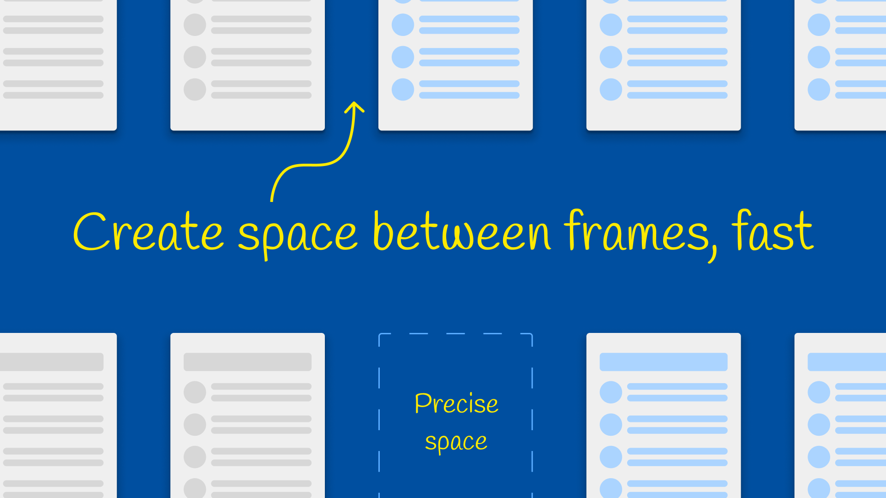

## ⚙️ Algorithm: Collision-Based Path Mimicry ("Make Way") - Iterative Sweep Version

This algorithm creates space next to a selected node **S** by simulating a **single-pass, left-to-right iterative movement ripple** among its siblings, followed by a **recursive upward resizing** of parent containers. The entire process is strictly limited to nodes that **vertically overlap** with **S** (or the temporary push-node **Z**).

* **S:** The original selected node.
* **SPACE_TO_CREATE:** The distance to create, typically $\text{width}(S) + 80$ pixels. (Note: $\text{width}(S)$ is the width of **S**.)

---

### 1. 🎯 Initial Node Creation (The Push)

1.  **Create Z:** Next to **S**, create a temporary, transparent **FrameNode** **Z** with $\text{width} = \text{SPACE\_TO\_CREATE}$ and $\text{height} = \text{height}(S)$.
2.  **Placement:** **Z** is positioned at $Z.x = S.x + S.width$.
3.  **Trigger Sweep:** Call the movement handler **PropagateShift** using **Z** as the catalyst.

---

### 2. 💥 Iterative Movement Sweep (The Lateral Ripple)

The **PropagateShift** function executes the movement in a single, non-recursive, left-to-right pass. 

#### Function: **PropagateShift**(**StartNode**, **Parent**, **ShiftAmount**)

1.  **Identify Frontier:** Set the initial **rippleFrontierX** to the **right edge** of the **StartNode** ($\text{StartNode.x} + \text{StartNode.width}$).
2.  **Filter and Sort Siblings:**
    * Filter **Parent.children** for movable nodes [**N**] that **vertically overlap** with **StartNode** AND are positioned **to the right** ($\text{N.x} \ge \text{StartNode.x}$).
    * **Sort:** The filtered list is **strictly sorted** by their absolute X-position (left-to-right).
3.  **Iterate and Move:** Iterate through the sorted siblings:
    * **IF N's left edge** ($\text{N.x}$) **< the current $\text{rippleFrontierX}$** (i.e., **N** is overlapping or touching the space/shifted node):
        * **Move N:** Shift **N** horizontally by the fixed **ShiftAmount**.
        * **Update Frontier:** Update **rippleFrontierX** to **N's new right edge** ($\text{N}_{\text{new}}.\text{x} + \text{N}.\text{width}$) to propagate the push to the next node in the sorted list.
    * **ELSE (No Overlap):**
        * **STOP** the iteration, as all subsequent sorted nodes are already beyond the ripple path.

---

### 3. 🖼️ Container Resizing (Local Parent)

1.  **Identify X:** **X** is the immediate parent of **S** (must be a **SectionNode**).
2.  **Resize X:** Increase the width of **X** by the **SPACE\_TO\_CREATE** distance.
3.  **Trigger Upward Propagation:** Call **PropagateResize** with **X**.

---

### 4. ⬆️ Upward Propagation and Parent Collision Check (Structural Growth Ripple)

The **PropagateResize** function handles cascading container growth up the node tree. 

#### Function: **PropagateResize**(**ResizedNode**, **SpaceCreatedInResize**, **level**)

1.  **Identify X & P:** **X** is the **ResizedNode**. **P** is the parent of **X**.
2.  **Parent Collision Check:** Apply lateral movement to **siblings** of **X** within **P**'s context. This pushes any sibling that now overlaps **X** due to **X**'s increased width.
    * Call **PropagateShift**(**X**, **P**, **SpaceCreatedInResize**).
3.  **Base Case:**
    * **IF P is the Page or Document node:** Run the final **PropagateShift** on **P**'s children, and **STOP** the recursion.
4.  **Recursive Step (P is a Section):**
    * **Resize P:** Increase the width of **P** by **SpaceCreatedInResize**.
    * **Recursive Call:** Recursively call **PropagateResize** with **P**.

---

### 5. Remove Z

1.  **Delete Z:** Delete the temporary node **Z**.